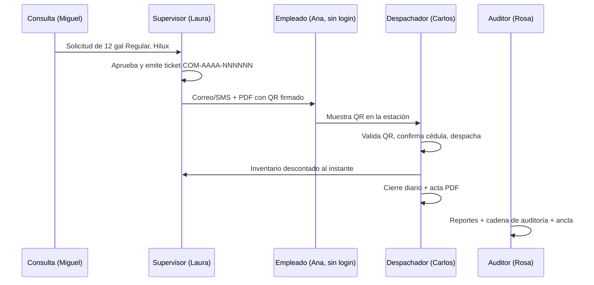

# Recorrido de ciclo de vida completo — TanQR

Guía para demostrar y probar **todas** las funciones que un usuario real toca, con varios
roles y datos ficticios listos para copiar. Cubre RF-01..RF-24 y RS-01..RS-06 del
`docs/SRS.pdf` (SRS Ticket Digitales v1.0, agosto 2026) según está **implementado hoy**,
no según el manual más antiguo.

Versión de producto: 0.4.0 · Fecha de esta guía: 2026-09-30.

## Cómo usar esta guía

1. Elige el entorno (local o Azure).
2. Copia las tablas de datos **tal cual** (códigos `VIAJE-*` para no chocar con catálogos `DEMO*` ya cargados).
3. Sigue los actos en orden. El inventario **se cierra al final**; si cierras el día antes, el resto de movimientos de esa fecha se rechazan.
4. Usa **dos navegadores o dos perfiles**: escritorio (admin / supervisor / consulta / auditor) y teléfono o ventana estrecha (despachador). Las sesiones viven solo en memoria: recargar la pestaña **cierra la sesión**.

| Entorno | URL | Administrador inicial |
|---|---|---|
| Local | http://localhost:5173 (API en http://127.0.0.1:5080) | Correo y contraseña en `artifacts/acceso-local.txt` (ignorado por Git) |
| Azure demo | https://intec-fuel-dev-b805.northcentralus.cloudapp.azure.com | `admin@combustible-demo.test` — contraseña **solo** en Key Vault `bootstrap-password` |

No uses datos reales de INTEC. Correos `@combustible-demo.test` y cédulas `000…` son ficticios a propósito.

**Correo real:** ACS en Azure rechaza destinatarios `.test` (SMTP 5.1.4). Si quieres ver el ticket en una bandeja, pon **un solo** empleado con tu correo real en el acto 2 y deja el resto ficticio.

**SMS:** en Trial de Twilio el mensaje es genérico (sin datos del ticket) y solo hasta 2026-09-30 (hora de República Dominicana). No es el envío personalizado que pide RF-09.

---

## Elenco (quién entra al sistema)

Un **empleado** no es una cuenta de login. Recibe el QR. Quien pide combustible en la web es el rol **Consulta**. Quien despacha es **solo** el Despachador (ADR-016): Administrador y Supervisor **no** tienen menú de Despacho ni Cierre.

### Cuentas de acceso (RF-01, RS-01, RS-02)

Contraseñas: frase de **15 a 128** caracteres, al menos 5 caracteres distintos, sin palabras comunes (`password`, `contraseña`, `qwerty`, `combustible`, `administrador`) y **sin incluir el correo**. Espacios y pegado están permitidos.

| Rol | Nombre para mostrar | Correo | Contraseña | Para qué sirve en el recorrido |
|---|---|---|---|---|
| Administrador | ya existe | el del entorno | la del entorno | Usuarios, parámetros, MFA, OAuth, catálogos, solicitudes, inventario, reportes, auditoría. **No despacha.** |
| Supervisor | Laura Méndez | `laura.mendez@combustible-demo.test` | `Viaje campus norte 26` | Catálogos, inventario, aprobar/rechazar, anular, programaciones, tablero, reportes |
| Despachador | Carlos Peña | `carlos.pena@combustible-demo.test` | `Bomba campus norte 26` | Tickets (consulta), escanear QR, despachar, cierre diario |
| Auditor | Rosa Jiménez | `rosa.jimenez@combustible-demo.test` | `Revision campus norte 26` | Tablero, reportes, auditoría y ancla firmada. Solo lectura operativa |
| Consulta | Miguel Soto | `miguel.soto@combustible-demo.test` | `Pedido campus norte 26` | Crear solicitudes y ver tickets. **No** ve reportes ni inventario |
| (opcional) bloqueo | Cuenta de prueba | `bloqueo.viaje@combustible-demo.test` | `Prueba bloqueo norte 26` | Cinco logins fallidos → bloqueo 15 min |

### Qué ve cada rol en el menú (verificado en la interfaz)

| Módulo | Admin | Supervisor | Despachador | Auditor | Consulta |
|---|---|---|---|---|---|
| Tablero | sí | sí | | sí | |
| Solicitudes | sí | sí | | | sí |
| Tickets | sí | sí | sí | | sí |
| Programaciones | sí | sí | | | |
| Despacho | | | sí | | |
| Cierre diario | | | sí | | |
| Inventario | sí | sí | | | |
| Reportes | sí | sí | | sí | |
| Notificaciones | sí | sí | | | |
| Departamentos / Empleados / Vehículos | sí | sí | | | |
| Parámetros / Integraciones / Usuarios | sí | | | | |
| Auditoría | sí | | | sí | |
| Mi seguridad | sí | sí | sí | sí | sí |

---

## Datos de catálogo (RF-02, RF-03, RF-04, RF-14)

Créalos **en este orden**: departamentos → combustibles → estación → tanques → empleados → vehículos. Un tanque nace con existencia **0**; el combustible entra después por recepción.

### Departamentos

| Código | Nombre |
|---|---|
| VIAJE-TRA | Transporte (demo viaje) |
| VIAJE-MAN | Mantenimiento (demo viaje) |
| VIAJE-SEG | Seguridad (demo viaje) |

### Combustibles

| Código | Nombre |
|---|---|
| VIAJE-GR | Gasolina Regular (demo) |
| VIAJE-GP | Gasolina Premium (demo) |
| VIAJE-GO | Gasoil (demo) |

### Estación

| Código | Nombre |
|---|---|
| VIAJE-NOR | Estación Campus Norte (demo) |

### Tanques

El nivel crítico se usa para la alerta de inventario bajo (RF-23). Deja Regular justo por encima del crítico para bajarlo con un despacho.

| Código | Estación | Combustible | Capacidad (gal) | Nivel crítico (gal) |
|---|---|---|---|---|
| VIAJE-T-GR | Estación Campus Norte (demo) | Gasolina Regular (demo) | 2000 | 400 |
| VIAJE-T-GP | Estación Campus Norte (demo) | Gasolina Premium (demo) | 1500 | 300 |
| VIAJE-T-GO | Estación Campus Norte (demo) | Gasoil (demo) | 3000 | 500 |

### Empleados (cédula = exactamente 11 dígitos)

La cédula, el correo y el móvil se cifran en reposo (RS-03). Solo Administrador y Supervisor ven esos campos.

| Código | Nombre completo | Cédula | Departamento | Cargo | Correo | Móvil |
|---|---|---|---|---|---|---|
| VIAJE-E01 | Ana Pérez Reyes | 00000001001 | Transporte (demo viaje) | Conductora | `ana.perez@combustible-demo.test` | `+18095551001` |
| VIAJE-E02 | Luis Gómez Díaz | 00000001002 | Mantenimiento (demo viaje) | Técnico de flota | `luis.gomez@combustible-demo.test` | `+18095551002` |
| VIAJE-E03 | Elena Vargas Ruiz | 00000001003 | Seguridad (demo viaje) | Supervisora de ronda | `elena.vargas@combustible-demo.test` | `+18095551003` |

Si vas a mostrar el correo institucional: edita **solo** `VIAJE-E01` y sustituye el correo por el tuyo (formato de correo válido, no `.test`).

### Vehículos (capacidad del tanque limita la solicitud)

Por defecto hay **como máximo 1 ticket activo por vehículo**. No pidas un segundo ticket del mismo vehículo hasta consumir o anular el anterior.

| Placa | Ficha | Marca | Modelo | Año | Tipo | Departamento | Capacidad (gal) | Odómetro (km) |
|---|---|---|---|---|---|---|---|---|
| VJ-1001 | F-1001 | Toyota | Hilux | 2023 | Pickup | Transporte (demo viaje) | 80 | 45210 |
| VJ-1002 | F-1002 | Nissan | Frontier | 2022 | Pickup | Mantenimiento (demo viaje) | 70 | 38100 |
| VJ-1003 | F-1003 | Hyundai | Tucson | 2024 | SUV | Seguridad (demo viaje) | 60 | 12500 |

### Recepción inicial (RF-16) — hazla **antes** de despachar

Fecha de recepción: el **día operativo de hoy** en zona `America/Santo_Domingo` (`AAAA-MM-DD`). RNC: 9 u 11 dígitos.

| Tipo | RNC | Suplidor | Factura | Tanque | Galones |
|---|---|---|---|---|---|
| Recepción | 131000001 | Combustibles del Valle, S.R.L. (demo) | FAC-VIAJE-001 | VIAJE-T-GR | 500 |
| Compra | 131000001 | Combustibles del Valle, S.R.L. (demo) | FAC-VIAJE-002 | VIAJE-T-GP | 400 |
| Recepción | 40100011222 | Diesel Andino, S.A. (demo) | FAC-VIAJE-003 | VIAJE-T-GO | 800 |

Saldos esperados después de esto: Regular **500**, Premium **400**, Gasoil **800**. Regular aún no está en crítico (crítico = 400).

---

## Historia que vas a contar

Una semana de operación en el campus: Transporte pide gasolina para la Hilux, Mantenimiento tiene una solicitud que se rechaza y otra que se anula, Seguridad despacha de menos con motivo, el inventario se mueve, se cierra el día y Auditoría se lleva el ancla.

Los números de ticket serán `COM-2026-00000N` (o el siguiente correlativo si Azure ya emitió COM-2026-000001…). Anota el número real en la columna “Número emitido” de cada acto.

---

## Acto 0 — Entrar y reglas de sesión (RS-01)

1. Abre la URL del entorno. No recargues a mitad de un flujo.
2. Entra con el administrador.
3. Comprueba **Mi seguridad**: cambiar contraseña y MFA están ahí. **No actives MFA en el admin todavía** (el resto del recorrido sería más lento). Se activa en el acto 12 con la auditora.

Si ves “Demasiados intentos. Espera un minuto.”: son 5 fallos / 15 minutos. No es un error de red.

---

## Acto 1 — Administración (RF-01, RF-08, RF-24, RS-05)

Con el **Administrador**:

1. **Usuarios →** crea las cinco cuentas de la tabla (rol + contraseña). El secreto se comparte por un canal aparte; aquí está escrito porque es demo ficticia.
2. **Parámetros** (déjalo así, es el valor de fábrica y el del SRS resuelto en ADR-007):
   - Prefijo `COM`
   - Reinicio anual: sí
   - Vigencia: **7** días
   - Aviso de vencimiento: **24** horas
   - Tickets activos por vehículo: **1**
3. **Integraciones →** crea un cliente OAuth 2.0:
   - Nombre: `VIAJE - Sistema de flota (solo lectura)`
   - Rol: `Auditor` (nunca Administrador ni Despachador; un cliente OAuth **no puede** despachar ni cerrar).
   - Copia **una sola vez** el `client_secret`. Endpoint: `/connect/token`, scope el que muestre la pantalla.
4. Cierra sesión.

**Comprobación de menú:** entra un segundo con cada rol y confirma la tabla de módulos. Luego sigue con Supervisor.

---

## Acto 2 — Catálogos (RF-02..RF-04)

Con **Laura (Supervisor)**:

1. Departamentos, luego (en Inventario, pestañas de catálogo, o las pantallas de combustibles/estaciones/tanques según el menú) combustibles, estación y tanques.
2. Empleados y vehículos con los datos de las tablas.
3. Edita un empleado (por ejemplo el cargo de Luis) y guarda: debe exigir recargar si otro cambió el mismo registro (“El registro cambió…”).
4. Opcional: abre el mismo empleado con Consulta — **no** debe ver cédula/correo/móvil (ADR-016). Consulta ni siquiera tiene menú de Empleados; la prueba de PII es Admin/Supervisor sí, el resto no vía API.

---

## Acto 3 — Cargar inventario (RF-14, RF-15, RF-16, RF-17)

Sigue con **Laura**:

1. Inventario → **Recepciones**. Registra las tres facturas.
2. **Existencias:** saldos 500 / 400 / 800; Regular no crítico.
3. **Movimientos:** tres entradas; no se pueden editar ni borrar.

---

## Acto 4 — Solicitar y decidir (RF-05, RF-06, RF-10, RF-11)

Cierra sesión. Entra **Miguel (Consulta)**:

| # | Empleado | Vehículo | Depto | Combustible | Galones | Notas | Qué hará Laura |
|---|---|---|---|---|---|---|---|
| S1 | Ana Pérez Reyes | VJ-1001 | Transporte | Regular | 12 | Ruta de campus 30 sep | Aprobar |
| S2 | Luis Gómez Díaz | VJ-1002 | Mantenimiento | Premium | 8 | Pedido duplicado | Rechazar |
| S3 | Elena Vargas Ruiz | VJ-1003 | Seguridad | Regular | 10 | Ronda nocturna | Aprobar y más tarde despachar de menos |
| S4 | Luis Gómez Díaz | VJ-1002 | Mantenimiento | Premium | 6 | Tras el rechazo, pedido bueno que se anula | Aprobar y **anular** el ticket |
| S5 | Ana Pérez Reyes | VJ-1001 | Transporte | Regular | 15 | **Después de S1 consumido y del acto 7** (Regular en 10 gal) | Aprobar; despacho de 15 debe fallar por stock |

Cantidad: no puede superar el tanque del vehículo (Hilux 80, Frontier 70, Tucson 60).
En este acto registra **solo S1–S4**. S5 se pide después de consumir S1 y de bajar Regular en el acto 7 (un vehículo no puede tener dos tickets activos).

**Vence (opcional):** déjalo vacío en S1–S4 (7 días). En S5, si quieres forzar “Próximo a vencer / Vencido” en la misma sesión, pon vencimiento a **1 hora** desde ahora (mínimo 1 hora, máximo 90 días, hora de Santo Domingo). El job periódico marca *Próximo a vencer* 24 h antes; con vigencia de 1 h verás *Vencido* al pasar esa hora.

Cierra sesión. Entra **Laura**:

1. Solicitudes → **Rechazar** S2 con motivo `Pedido duplicado; se tramita el siguiente`.
2. **Aprobar y emitir ticket** S1, S3, S4.
3. Tickets: anota número, estado (`Creado`, `Enviado` o `Pendiente de entrega`) y descarga **PDF** y **QR** de S1.
4. Abre el PDF: el QR debe verse (no un recuadro vacío).
5. **Anular** el ticket de S4 con motivo `El vehículo entra a taller; no se despacha`. Motivo mínimo 5 caracteres.

Estados que debes haber tocado al terminar el día:

| Estado | Cómo se produce en este viaje |
|---|---|
| Creado | Emisión reciente, entrega aún no confirmada |
| Enviado | Correo o SMS con resultado Sent |
| Pendiente de entrega | Destinatario `.test` o SMTP/SMS fallido |
| Próximo a vencer | Job con `WarningHours` (o espera si pusiste 1 h de vigencia) |
| Vencido | Pasó `expiresAt` sin despachar |
| Consumido | Despacho confirmado (acto 6) |
| Anulado | Ticket de S4 |

---

## Acto 5 — El empleado y el QR (RF-07, RF-09, RS-04)

El empleado **no entra** al sistema.

1. Si el correo de Ana es real: abre el mensaje, el enlace público `/ticket/<id>.<token>` y el PDF.
2. Si no hay bandeja: desde Tickets, **Ver QR** y **Descargar PDF**. El payload del QR empieza por `IC1.` y está firmado (ECDSA P-256).
3. En local, Mailpit recibe el SMTP de prueba.
4. Un QR alterado (cambia un carácter del texto) debe rechazarse al validar. No despaches con un QR inventado: **no hay otra ruta de despacho** (CA-2).

---

## Acto 6 — Despacho en estación (RF-12, RF-13, CA-2, CA-3)

Entra **Carlos (Despachador)** en el segundo perfil (idealmente ventana móvil o PWA).

1. Despacho → pega el texto del QR de **S1** en “Código QR (lector externo o texto)” → **Validar código**. Debe decir **TICKET VÁLIDO**. Validar **no** consume.
2. Identidad: pantalla con nombre, **últimos 4 de cédula** (`1001` para Ana), placa `VJ-1001`, 12 gal Regular. Marca **Verifiqué la cédula del portador**.
3. Tanque `VIAJE-T-GR`. Galones despachados `12`. Odómetro `45250` (mayor o igual que el actual).
4. **Confirmar despacho.** Inventario Regular: 500 − 12 = **488**. Ticket **Consumido**.
5. **Despachar otro ticket** y vuelve a pegar el mismo QR: rechazo por consumido. El movimiento de despacho sigue siendo uno solo.

**S3 (de menos, ADR-007 / H-02):** un ticket = un despacho, > 0 y ≤ autorizado. Menos de lo autorizado **consume el ticket entero**.

1. Valida el QR de S3.
2. Confirma identidad (cédula termina en `1003`).
3. Tanque Regular, galones `8`, motivo de diferencia `Tanque del vehículo no admitió más`.
4. Confirmar. Regular: 488 − 8 = **480**. Ticket Consumido. Diferencia −2 en reportes de despacho.

**Intentos que deben fallar (sin mover stock):**

| Prueba | Cómo | Resultado esperado |
|---|---|---|
| Más de lo autorizado | QR de un ticket activo, 999 gal | 422 / mensaje de autorizado |
| Sin confirmar identidad | deja la casilla vacía | no despacha |
| Combustible / tanque incorrecto | tanque de gasoil para un ticket Regular | rechazo |
| Sin red | modo avión en el teléfono | aviso rojo; nada encolado (H-07) |
| Admin o Supervisor | no hay menú Despacho | separación de funciones |

**S5 (stock insuficiente):** no lo apruebes todavía. Primero termina el acto 7 hasta dejar Regular **por debajo de 15 gal**. Entonces Laura aprueba S5 (el vehículo ya no tiene ticket activo). Carlos intenta despachar 15 gal → rechazo por existencia insuficiente; el saldo no cambia y el ticket **sigue activo**. Un ajuste positivo (o anulación de S5) desbloquea el vehículo.

---

## Acto 7 — Transferencia, ajuste y alerta (RF-14, RF-15, RF-17, RF-23)

Vuelve **Laura** (Inventario). **Antes del cierre diario.**

Tras S1 y S3, Regular está en **480**.

1. **Merma** 20 gal en Premium, motivo `Merma por medición de varilla (demo)`. Notificación de ajuste.
2. **Ajuste negativo** 90 gal en Regular, motivo `Ajuste a medición física previa al cierre`. 480 − 90 = **390** < 400 → tanque **crítico** y notificación **Inventario bajo**.
3. **Ajuste negativo** 380 gal en Regular, motivo `Dejar saldo de demo para probar stock insuficiente`. Queda **10**. Ahí Laura aprueba S5 y Carlos intenta despachar 15.
4. **Ajuste positivo** 50 gal en Regular (queda 60) si quieres dejar un saldo razonable para el cierre, o anula S5.
5. Opcional: tanque `VIAJE-T-GR2` (capacidad 500, crítico 50) y **transferencia** 30 gal GR → GR2 (mismo combustible). Premium no se transfiere a Regular.

Los movimientos no se editan ni se borran.

---

## Acto 8 — Programación automática (RF-05, RF-11)

Con **Laura**, Programaciones:

| Campo | Valor |
|---|---|
| Nombre | `VIAJE - Ruta semanal de transporte` |
| Empleado / vehículo / depto / combustible | Ana / VJ-1001 / Transporte / Regular |
| Regla | Cantidad fija |
| Cantidad | 10 |
| Frecuencia | Semanal |
| Próxima ejecución | mañana 07:00 (Santo Domingo) |
| Aprobar automáticamente | sí |
| Activa | sí |

Si el vehículo aún tiene un ticket activo (S5), la generación fallará o quedará en error de programación: anula o despacha S5 primero. Una programación **Once** con `NextRunAt` dentro de un minuto demuestra emisión automática si el job está activo.

---

## Acto 9 — Cierre diario (RF-18)

Con **Carlos**, cuando ya no vayas a mover inventario **hoy** en esa estación:

1. Cierre diario → estación Campus Norte → día de hoy.
2. Resumen: despachos de S1 y S3, volumen, saldo teórico.
3. Medición física (ejemplo, ajusta a lo que veas en existencias):

| Tanque | Conteo físico (gal) |
|---|---|
| VIAJE-T-GR | el saldo teórico que muestre la pantalla |
| VIAJE-T-GP | igual al teórico |
| VIAJE-T-GO | igual al teórico |

4. Confirmar. Descarga el **acta PDF**. El día queda bloqueado.
5. Intenta otra recepción o despacho con esa fecha en esa estación: **rechazado**.
6. Intenta cerrar el mismo día otra vez: **rechazado**.

---

## Acto 10 — Tablero, notificaciones y reportes (RF-19, RF-20, RF-22, RF-23)

Con **Laura** o **Rosa**:

1. **Tablero:** inventario por tanque (Regular crítico si hiciste el acto 7), despachado hoy, tickets activos/vencidos, consumo por departamento y vehículo.
2. **Notificaciones:** inventario bajo, ajustes, fallas de entrega (empleados `.test`). Márcalas leídas.
3. **Reportes** — periodo = hoy, filtros departamento Transporte / Regular:

| Tipo | Qué debes ver | Exporta |
|---|---|---|
| Tickets | S1 Consumido, S3 Consumido, S4 Anulado, S2 no es ticket | CSV, XLSX, PDF |
| Despachos | 12 gal Ana, 8 gal Elena, diferencia en S3 | CSV, XLSX, PDF |
| Movimientos | recepciones, despachos, merma/ajustes, transferencias | CSV, XLSX, PDF |
| Consumo | Transporte y Seguridad con galones | CSV, XLSX, PDF |

Cada exportación queda en auditoría (RF-21). La vista en pantalla corta a 500 filas; el archivo llega hasta 20 000.

Consulta **no** tiene Reportes. Despachador **no** tiene Tablero ni Reportes.

---

## Acto 11 — Auditoría inalterable (RF-21, RS-06)

Con **Rosa (Auditor)**:

1. Auditoría: altas de usuario, catálogos, aprobaciones, despachos, ajustes, anulaciones, exportaciones, IPs.
2. Verificar cadena (si la pantalla o API lo ofrece): `valid: true`.
3. **Descargar ancla firmada** (JSON). Guárdala **fuera** del sistema (correo, disco). El ancla solo sirve si existe esa copia externa.
4. No intentes “corregir” un movimiento: el rol SQL de la app no hace UPDATE/DELETE sobre auditoría ni sobre el mayor de inventario.

---

## Acto 12 — MFA y bloqueo (RS-01, RF-01)

1. Entra **Rosa** → Mi seguridad → activa TOTP (contraseña + código de 6 dígitos). **Guarda los códigos de recuperación**; se muestran una vez.
2. Cierra sesión. Vuelve a entrar con contraseña **y** código (o un recovery de un solo uso).
3. Opcional: cuenta `bloqueo.viaje@…` → 5 contraseñas incorrectas → bloqueo 15 min.

No desactives el último administrador. Un admin no puede cambiarse el rol a sí mismo.

---

## Acto 13 — PWA en el teléfono (RF-13, CA-6)

HTTPS hace falta para cámara e instalación. En Azure ya hay TLS 1.3.

1. Chrome en Android → menú → Instalar aplicación.
2. Despacho → cámara, o foto del QR, o teclado de pistola.
3. CA-6 (Android físico + cámara real) sigue pendiente de evidencia de campo; el emulador Pixel 7 de Playwright no lo cierra.

---

## Lista de comprobación rápida

- [ ] Cinco roles creados; menús coinciden con la tabla
- [ ] Catálogos `VIAJE-*` y tres recepciones
- [ ] S1 emitido, PDF con QR, despacho 12 gal, reuso rechazado
- [ ] S2 rechazada; S4 anulada
- [ ] S3 despachado de menos con motivo
- [ ] Ajuste/merma + inventario crítico + notificación
- [ ] Programación semanal creada (vehículo sin ticket activo)
- [ ] Cierre del día + acta PDF + segundo cierre rechazado
- [ ] Reportes CSV, XLSX y PDF
- [ ] Ancla de auditoría descargada
- [ ] MFA en un usuario
- [ ] Cliente OAuth creado; secreto copiado una vez

---

## Mapa requisito → acto

| ID | Requisito | Acto |
|---|---|---|
| RF-01 | Usuarios y roles | 1, 12 |
| RF-02 | Empleados | 2 |
| RF-03 | Vehículos | 2 |
| RF-04 | Departamentos | 2 |
| RF-05 | Solicitudes manuales y programadas | 4, 8 |
| RF-06 | Emisión, PDF, correo, QR | 4, 5 |
| RF-07 | QR firmado, no reutilizable | 5, 6 |
| RF-08 | Numeración COM-AAAA-NNNNNN | 1, 4 |
| RF-09 | Envío correo/SMS y enlace público | 5 (SMS real: ver límites) |
| RF-10 | Siete estados | 4, 6, 9 |
| RF-11 | Asignación manual y automática | 4, 8 |
| RF-12 | Despacho con identidad | 6 |
| RF-13 | PWA | 6, 13 |
| RF-14 | Entradas, salidas, ajustes | 3, 6, 7 |
| RF-15 | Inventario en tiempo real | 3, 6, 7, 10 |
| RF-16 | Recepción con RNC | 3 |
| RF-17 | Historial de movimientos | 3, 7, 10 |
| RF-18 | Cierre y acta | 9 |
| RF-19 / RF-20 | Reportes y export | 10 |
| RF-21 | Trazabilidad | 11 |
| RF-22 | Dashboard | 10 |
| RF-23 | Notificaciones | 7, 10 |
| RF-24 | API REST + OAuth | 1 |
| RS-01 | Auth, MFA, bloqueo | 0, 12 |
| RS-02 | RBAC | 1, menús |
| RS-03 | TLS 1.3 + AES-256-GCM | Azure / empleados |
| RS-04 | Firma del QR | 5, 6 |
| RS-05 | OAuth 2.0 client credentials | 1 |
| RS-06 | Auditoría encadenada + ancla | 11 |

---

## Lo que este recorrido no puede cerrar

- **CA-6:** Android físico con cámara.
- **RF-09 SMS personalizado:** Trial de Twilio; plantilla genérica caduca el 2026-09-30.
- **Datos reales INTEC, SMTP institucional, dominio propio:** B-02, B-03, B-04. No hacen falta para demostrar el producto con datos ficticios.
- **Carga masiva CSV/Excel** de catálogos: no existe; el alta es uno a uno.

Si un paso falla, no “arregles” saldos a mano en la base. El mayor solo crece con movimientos de la aplicación; un arreglo SQL rompe la historia que el Auditor va a leer.
